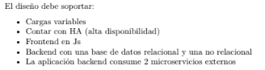

# Proceso de Resolución de la Prueba Técnica de Craftech

## Prueba 1

Para hacer este diagrama acorde a los requisitos solicitados decidí utilizar la plataforma Cacoo de Nulabs que tiene muchpisimos simbolitos para los servicios de AWS. No se si serán los más actuales pero se ven bastante bien.

Comencé la solución colocando los distintos grupos:
- Primero la AWS Cloud
- VPC
- Region, decidí por el momento utilizar una Region
- 2 Avaibility Zone, para garantizar uno de los puntos (Alta Disponibilidad)
- Luego utilicé 6 subnet( 4 privadas y 2 públicas), la idea es que repliquen una arquitectura de 3 capas bastante común pero y según los requisitos espejada para garantizar HA
- Como servicios Globales utilicé CloudFront como CDN y conectado a los S3 dentro de las subredes públicas para servir la aplicación web estática. El S3 sería Static Web Hosting, cumpliendo el requisito de frontend en js.
- Luego decidí utilizar también Route53 como DNS para redirigir tráfico.
- Utilicé el ELB, también pensé la posibilidad de utilizar ALB pero no encontré el simbolito así que me quedé con el primero, que se va a encargar de redirigir las peticiones entre subredes o mejor dicho entre la capa de Presentación y la capa de Aplicación.
- Respecto a la Capa de Aplicaciones utilicé Instancias de EC2 para el backend, no había mucho especificación de que era o que hacía el backend por lo que no sabía si incluir microservicios a parte como autenticación o caché, o usar task runners de un Lambda por ej, así que lo dejé lo más simple que se me ocurrió, Utilicé IAM para el manejo de usuarios y podría haber agregado cognito pero no estaba seguro. Esta capa se encuentra por cierto en un Auto-Scalling group para garantizar el requisito de cargas variables.
- Pasando a la capa de Persistencia, utilice RDS como base de datos relacional y conecté las subredes privadas de esta capa mediante Private Link para conectarme a la base en la nube MongoDB Atlas como base de datos no relacional, a fin de hacer un poco más diversa la arquitectura y cumpliendo el requisito de base de datos relacional + no relacional
- Por último decidí conectar dos microservicios externos a la capa de aplicaciones. No estaban especificados así que lo hice lo más general para que se conectaran con la capa de Aplicación. Así cumplía el requisito de 2 microservicios externos.

___

## Prueba 2

Para esta prueba comencé colocando las configuraciones en sus debidos lugares.
docker-compose en la raiz de ese proyecto, los Dockerfile en su respectiva carpeta( frontend y backend).

Cambios:
    Carpeta de Frontend: revisé los archivos de configuración y agregué la carpeta y el default para la configuración de nginx que se encargaría de servir la aplicación.
    Carpeta de Backend: Revise la ubicación de la .env.postegres y al ser las únicas variables de entornos decidí dejarlas ahí.
    Modifique el archivo de requeriments ya que el nombre tenía un error de tipeo.
    Agregué Gunicorn a los requeriments para usarlo en el dockerfile y crear correctamente la imagen.
    Eliminé el docker-compose de la base de datos ya que lo dejé todo listo en el que existe en la raiz de ese proyecto

DockerFile Frontend:
    Se encargar de builder la app de react, para ello utiliza una imagen de Node y realiza los pasos típicos de creación, copiado y ejecución de la aplicación en la imagen que está por crearse, servido por cierto por nginx y su configuración.
DockerFile Backend:
    Utiliza una imagen de python y copia todo la api del repositorio en la imagen.

docker-compose raiz:
    Crea 3 containers:
    - django_backend puerto 8000:8000
    - react_frontend puerto 3000:80 gracias nginx
    - postgres_db puerto 5432:5432

___

## Prueba 3

Para esta prueba cree un pipeline sencillo implementado mediante github Actions.

 1- cree la carpeta en la raiz del repositorio que contiene todas las pruebas .github/workflows
 2- Allí coloqué el archivo docker-pipeline.yml que genera un pequeño pipeline en el path 'prueba3-craftech/index.html' siempre que la rama sea master y como el requisito de la prueba indica se ejecutará cada vez que haya una modificación en el index.html del path

 3- Para el deploy primero aguregué un check de código, utilicé la action para buildear y la action para loguearse en DockerHub.
 4 Cree un access Token en DockerHub y junto con mi usuario cree los secrets en el repositorio para ser usadas al conectarse.
 5-Realizamos el buildeo y lo creo en DockeHub posteriormente.

 s